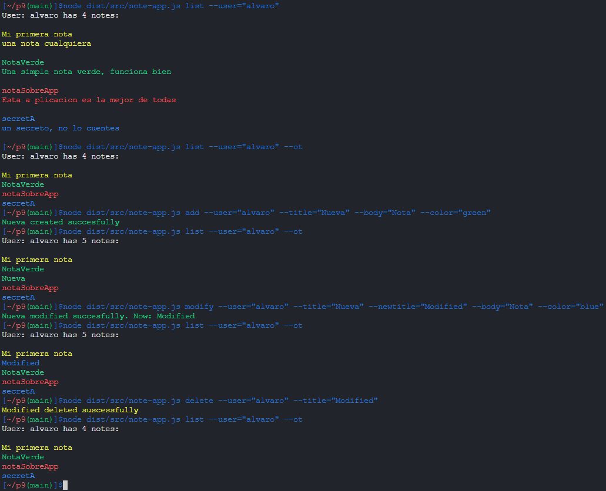

# Práctica 11 - Cliente y servidor para una aplicación de procesamiento de notas de texto

### Índice

1. [Introducción](#e1)   
2. [Ejemplo de ejecución](#e2)
3. [Código Fuente](#e3)


<a name="e1"></a>

### Introducción 

Esta práctica consistirá en apliar la aplicacion de notas de la práctica 9 para que el funcionamiento de esta
sea ejecutado por un servidor y este reciba las peticiones de una accion por parte de un cliente a traves de un socket.

Las notas de cada uno de los usuarios serán almacenadas ficheros dentro de un directorio propio de cada usuario.
Serán representadas con una estructura `JSON`.

En este proyecto vamos a valernos de estas herramientas para llevarlo a cabo:

* [Mocha](https://mochajs.org/) y [Chai](https://www.chaijs.com/): para incorporar TDD.
* [Typedoc](https://typedoc.org/): para realizar la documentación automática de nuestro codigo.
* [Instambul](https://istanbul.js.org/) Para mostrarnos los datos de cubrimiento de nuestros test.
* [Coveralls](https://coveralls.io/) Para llevar el seguimiento de `Instambul` en nuestro repositorio.
* [SonarCloud](https://sonarcloud.io/summary/new_code?id=ULL-ESIT-INF-DSI-2122_ull-esit-inf-dsi-21-22-prct09-filesystem-notes-app-AlvaroRGZ) Para llevar el seguimiento de calidad de codigo.
* [Yargs](https://www.npmjs.com/package/yargs) Para emplear un interprete de comandos.
* [Chalk](https://www.npmjs.com/package/chalk) Para cambiar el color de las salidas por pantalla.


Continuaremos con la misma estructura de directorios basada en las anteriores prácticas y emplearemos los
conocimientos aprendidos en:

* [El sistema de ficheros](https://ull-esit-inf-dsi-2122.github.io/nodejs-theory/nodejs-filesystem.html)
* [Sockets](https://ull-esit-inf-dsi-2122.github.io/nodejs-theory/nodejs-sockets.html)
* [Codigo asincrono y patron Callback](https://ull-esit-inf-dsi-2122.github.io/nodejs-theory/nodejs-http-callback-pattern.html)

<a name="e2"></a>


## Ejemplo de ejecución


<a name="e3"></a>


## Código fuente

Revisaremos los ficheros fuente de esta practica.

### Servidor (src/servidor)

El programa principal `src/servidor/server.ts` es muy sencillo:

```Typescript
let port = 60300;
if (process.argv[2]) {
  port = parseInt(process.argv[2]);
  if (port < 4096) {
    port = 60300;
  }
}
// Inicia el servidor
const server = new NoteServer(port, undefined);
```

Simplemente recibe o no un puerto al que atender peticiones e inicia el servidor.

Veamos la definicion de la clase `NoteServer` alojada en [src/servidor/noteServer.ts](../src/servidor/noteServer.ts) :

```Typescript
class NoteServer extends EventEmitter {
  private userDir: string = 'src/notas/';
  private server: net.Server;
  constructor(port: number, serverOpts: net.ServerOpts | undefined) {
    super();
    this.server = net.createServer(serverOpts);
    this.openServerOnPort(port);
```

La clase hereda de EventEmitter para poder crear y manejar sus eventos propios, como
detectar cuando recibe peticiones. Crea el servidor y le indica atender al puerto port.

```Typescript
this.server.on('connection', (connection) => {
  console.log('A client has connected.');
```

A continuación, el resto de constructor consiste en el manejador del evento `'connection'`,
que detecta cuando se conecta un cliente.

```Typescript
this.server.on('connection', (connection) => {
  console.log('A client has connected.');
```

Se define el manejador para el evento `'data'`, que detecta cuando se reciben datos.
Seguimos el protocolo de cuando reciba un \n, la clase manejadora, al heredar de evenEmitter,
emitira el evento 'request' para indicar que ha recibido una peticion.

```Typescript
let wholeData: string = '';
connection.on('data', (m) => {
  wholeData += m;
  let messageLimit = wholeData.indexOf('\n');
  while (messageLimit !== -1) {
    const message = wholeData.substring(0, messageLimit);
    wholeData = wholeData.substring(messageLimit + 1);
    this.emit('request', JSON.parse(message));
    messageLimit = wholeData.indexOf('\n');
  }
});
```

Definimos el manejador del evento propio `'request'`, registrado por el objeto de nuestra clase
gracias a que hereda de EventEmitter. Que como vimos antes recibe un objeto Peticion y
en primer lugar muestra los datos de desta por pantalla del servidor.
```Typescript
this.on('request', (request: mt.RequestType) => {
  print('-----------------------------------------', 'yellow');
  print(`Receibed REQUEST from ${request.user}`, 'yellow');
  console.log(`Command   : ${request.type}`);
  console.log(`User      : ${request.user}`);
  (request.title   ) ? console.log(`Title     : ${request.title}`): null;
  (request.body    ) ? console.log(`Body      : ${request.body}`): null;
  (request.color   ) ? console.log(`Color     : ${request.color}`): null;
  (request.newTitle) ? console.log(`New title : ${request.newTitle}`): null;
  print('-----------------------------------------', 'yellow');
```

Seguidamente, entra a un `switch` para determinar el tipo de peticion y, para cada caso,
implementa un codigo como el siguiente:

```Typescript
case 'add':
  // Comprobamos que los parametros se hayan recibido correctamente
  if (request.title && request.body && request.color) {
    // Llevamos a cabo la accion
    const result = this.createNote(request.title, request.body, request.user, request.color);
    if (result == 'OK') {
      // Enviamos un mensaje de exito con el nombre del fichero creado
      this.sendResponse({type: 'add', success: true, einfo: `${request.title}`}, connection);
    } else {
      // Enviamos un mensaje de error con la info del erro devuelta de la funcion
      this.sendResponse({type: 'add', success: false, einfo: result}, connection);
    }
  } else {
    // Notificamos al cliente de que los datos no son validos
    this.sendResponse({type: 'add', success: false, einfo: 'Bad Arguments.'}, connection);
  }
  break;
```
Como vemos, en el programa seguiremos otro protocolo propio para controlar los errores que puedan
ocurrir en las acciones. Las funciones devuelven un objeto `string`, que si es igual a `'OK'`,
indica que funciono correctamente, en caso contrario, la `string` contendra el mensaje informativo
del error. Todos los demas casos del switch son iguales cambiando las llamadas a las funciones y los mensajes devueltos. 

Una vez el servidor haya enviado una respuesta, termina la comunicacion con el cliente.
```Typescript
connection.end();
this.removeAllListeners();
```

#### Funciones del servidor
  Como vimos antes, todas las funciones comprueban cualquier error que pueda ocurrir durante la ejecución y en caso de error devuelven la informacion sobre ese error o `'OK'` si hubo exito.
#### getNoteAtributte

Obtiene el atributo deseado de la nota perteneciente al usuario que indiquemos.
Comprueba que el directorio exista, luego si el fichero existe y si es así,
accede a los atributos del objeto `JSON` obtenido. Si hay algún problema durante
la ejecución del programa, se devuelve `undefined`.

```Typescript
getNoteAtributteSync(title: string, user: string, attr: string): string | undefined {
    let out: string = '';
    if (fs.existsSync(this.userDir + user)) {
      if (fs.existsSync(this.userDir + user + '/' + title)) {
        switch (attr) {
          case 'title':
            out = JSON.parse(fs.readFileSync(this.userDir + user + '/' + title).toString()).title;
            break;
          case 'color':
            out = JSON.parse(fs.readFileSync(this.userDir + user + '/' + title).toString()).color;
            break;
          case 'body':
            out = JSON.parse(fs.readFileSync(this.userDir + user + '/' + title).toString()).body;
            break;
        }
      } else {
        console.log(chalk.redBright(`Error. ${title} doesnt exist.`));
      }
    } else {
      console.log(chalk.redBright(`Error. ${user} directory not found.`));
    }
    if (out !== '') {
      return out;
    } else {
      return undefined;
    }
  }
}
```

Tambien se ha implementado la version asincrona de ella (en desuso), que implementa el patron callback.
Que funciona igual pero utiliza la version asincrona de fs.readFile y en vez de retornar los valores,
invoca al callback para que nosotros podamosa acceder a dichos valores, indicando si ha habido error o no. 

```Typescript
  getNoteAtributte = ((title: string, user: string, attr: string,
                  callBack: (error: string | undefined, data: string | undefined) => void) => {
    if (fs.existsSync(this.userDir + user)) {
      if (fs.existsSync(this.userDir + user + '/' + title)) {
        fs.readFile(this.userDir + user + '/' + title, (error, data) => {
          if (error) {
            callBack(error.message, undefined);
          } else {
            switch (attr) {
              case 'title':
                callBack(undefined, JSON.parse(data.toString()).title);
                break;
              case 'color':
                callBack(undefined, JSON.parse(data.toString()).color);
                break;
              case 'body':
                callBack(undefined, JSON.parse(data.toString()).body);
                break;
            }
          }
        });
      } else {
        console.log(chalk.redBright(`Error. ${title} doesnt exist.`));
      }
    } else {
      console.log(chalk.redBright(`Error. ${user} directory not found.`));
    }
  });

```
***
#### readNote

Lee una nota concreta de un usuario. Comprueba que el directorio de ese usuario exista y
que exista el fichero que almacena esa nota. Obtiene todos los datos de la nota (el objeto `JSON`)
y construye el objeto `Note` para devolverlo.
La funcion devuelve `undefined` indicando si ha ha habido algún error o la nota en cuestion.

```Typescript
readNote(title: string, user: string): mt.Note | undefined {
  const note: mt.Note = {title: '', body: '', color: 'blue'};
  let succes: boolean = false;
  if (fs.existsSync(this.userDir + user)) {
    if (fs.existsSync(this.userDir + user + '/' + title)) {
      const noteTitle: string = this.getNoteAtributteSync(title, user, 'title') as string;
      const noteBody: string = this.getNoteAtributteSync(title, user, 'body') as string;
      const noteColor: mt.Color = this.getNoteAtributteSync(title, user, 'color') as mt.Color;
      if (noteTitle !== undefined && noteBody !== undefined && noteColor !== undefined) {
        note.title = noteTitle;
        note.body  = noteBody;
        note.color = noteColor;
        succes = true;
      } else {
        console.log(chalk.redBright(`Error. Accesing ${title} atributes.`));
      }
      console.log();
    } else {
      console.log(chalk.redBright(`Error. ${title} does not exist.`));
    }
  } else {
    console.log(chalk.redBright(`Error. ${this.userDir + user} directory not found.`));
  }
  if (succes) {
    return note;
  } else {
    return undefined;
  }
}
```
***
#### listNotes

Lista  las notas de el usuario indicado en su color propio.
Comprueba que el directorio de ese usuario exista, obtiene los nombres de los
ficheros que contiene, y obtiene cada nota llamando a `readNote()`.
La funcion devuelve `undefined` indicando si ha habido algún error o devuelve
vector de notas obtenido.

```Typescript
listNotes(user: string): mt.Note[] | undefined {
const notes: mt.Note[] = [];
  let succes: boolean = true;
  if (fs.existsSync(this.userDir + user)) {
    const files: string[] = fs.readdirSync(this.userDir + user);
    files.forEach((f) => {
      const note = this.readNote(f, user);
      if (note) {
        notes.push(note);
      } else {
        succes = false;
      }
    });
  } else {
    console.log(chalk.redBright(`Error. Directory ${this.userDir + user} does not exit.`));
    succes = false;
  }
  if (succes) {
    return notes;
  } else {
    return undefined;
  }
}
```
***
#### deleteNote

Borra una nota de un usuario. Comprueba que el directorio de ese usuario exista y el fichero en cuestión y lo elimina .
La funcion implementa el protocolo de `string` anteriormente explicado.

```Typescript
deleteNote(tittle: string, user: string): string {
  if (fs.existsSync(this.userDir + user)) {
    if (fs.existsSync(this.userDir + user + '/' + tittle)) {
      fs.rmSync(this.userDir + user + '/' + tittle);
    } else {
      return `Error. ${tittle} doesnt exist.`;
    }
  } else {
    return `Error. ${user} directory not found.`;
  }
  return 'OK';
}
```
***
#### modifyNote

Simplemente busca la nota que queremos modificar, la elimina y crea una nueva con los nuevos datos.
La funcion implementa el protocolo de `string` anteriormente explicado.

```Typescript
modifyNote(tittle: string, newtitle: string, body: string, user: string, color: string): string {
  if (fs.existsSync(this.userDir + user + '/' + tittle)) {
    this.deleteNote(tittle, user); // Borramos la anterior
    return this.createNote(newtitle, body, user, color); // Creamos una nueva
  } else {
    return `Error. ${tittle} not exists`;
  }
}
```
***
#### createNote

Crea una nota nueva. Se asegura de que los parametros sean válidos y luego comprueba si el directorio
de ese usuario ya existe, si no es así (todavía no había ninguna nota guardada por ese usuario), crea
ese directorio. Hecho esto, comprueba que exista una nota con ese titulo y en caso negativo
crea el fichero con los datos indicados.
La funcion implementa el protocolo de `string` anteriormente explicado.

```Typescript
createNote(title: string, body: string, user: string, color: string): string {
  if (title === '' || body === '' ||
      user === '' || color === '' ) {
    console.log(chalk.redBright(`Error. Wrong arguments.`));
    return `Error. Wrong arguments.`;
  } else {
    if (!fs.existsSync(this.userDir + user)) {
      fs.mkdirSync(this.userDir + user, {recursive: true});
    }
    if (!fs.existsSync(this.userDir + user + '/' + title)) {
      fs.writeFileSync(this.userDir + user + '/' + title, JSON.stringify({title, body, color}, null, ' '));
    } else {
      console.log(chalk.redBright(`Error. ${title} already exists.`));
      return `Error. ${title} already exists.`;
    }
  }
  return 'OK';
}
```
***
#### sendResponse

Envia una respuesta al cliente por el socket recibido, sigue el protocolo de enviar la peticion
y marcarla como terminada con un retorno de carro `\n`.
```Typescript
sendResponse(message: mt.ResponseType, socket: net.Socket) {
  socket.write(JSON.stringify(message) + '\n');
}
```
***
#### openServerOnPort

Indica al server por que puerto debe atender.
```Typescript
  openServerOnPort(port: number) {
    this.server.listen(port, () => {
      console.log('Waiting for clients to connect.');
    });
  }
```
***
### Funciones impresoras

Estas funciones emplean el paquete [Chalk](https://www.npmjs.com/package/chalk)

#### print

Imprime el texto indicado en el color `color` por pantalla.
```Typescript
export function print(s: string, c?: string) {
  switch (c) {
    case 'blue':
      console.log(chalk.blueBright(s));
      break;
    case 'red':
      console.log(chalk.redBright(s));
      break;
    case 'green':
      console.log(chalk.greenBright(s));
      break;
    case 'white':
      console.log(chalk.whiteBright(s));
      break;
    case 'yellow':
      console.log(chalk.yellowBright(s));
      break;
    default:
      console.log(chalk.whiteBright(s));
      break;
  }
}
```
***
#### bgprint

Imprime el texto indicado por pantalla con un background de color `color`.
```Typescript
export function bgprint(s: string, c: string) {
  switch (c) {
    case 'blue':
      console.log(chalk.bgBlueBright(s));
      break;
    case 'red':
      console.log(chalk.bgRedBright(s));
      break;
    case 'green':
      console.log(chalk.bgGreenBright(s));
      break;
    case 'yellow':
      console.log(chalk.bgYellowBright(s));
      break;
    default:
      console.log(chalk.bgWhiteBright(s));
      break;
  }
}
```
***
#### printNote
Imprime una nota con todos sus campos y su propio color.
```Typescript
export function printNote(note: mt.Note) {
  print(note.title, note.color);
  print(note.body, note.color);
}
```
### Programa Cliente principal - Comandos

En este fichero hallamos la creacion del objeto del cliente y la funcion que ejecuta todas las demás.

```Typescript
const socket = connect({port: 60300});
const client = new NoteClient(socket);

 /*
 ...
 comandos
 ...
 */

 yargs.parse()
```

Como ya hemos visto `yargs` en practicas anteriores, me centrare en
excplicar un solo ejemplo por que el resto son identicos, cambiando los tipos de mensajes.
Veamos por ejemplo el manejador del comando `add`.

### add
Define un comando para añadir notas, recibe los parametros que vemos, el usuario, titulo, cuerpo
y color de la nueva nota. Dentro, llama al metodo `sendRequest` del cliente para enviar la peticion al 
servidor, pasandole un objeto `request` creado con los datos necesarios para la peticion.

```Typescript
yargs.command({
  command: 'add',
  describe: 'Add a new note',
  builder: {
    user: {
      describe: userName,
      demandOption: true,
      type: 'string',
    },
    title: {
      describe: noteTittle,
      demandOption: true,
      type: 'string',
    },
    body: {
      describe: 'Note body',
      demandOption: true,
      type: 'string',
    },
    color: {
      describe: 'Note color',
      demandOption: true,
    },
  },
  handler(argv) {
    if (typeof argv.title === 'string' && typeof argv.user === 'string' &&
        typeof argv.body === 'string') {
      // Construye el mensaje de peticion y lo envia al servidor
      client.sendRequest({type: 'add', user: argv.user, title: argv.title, body: argv.body, color: argv.color as mt.Color});
    }
  },
});
```
***

## Implementacion del Cliente

Veamos la definicion de la clase `NoteClient` alojada en [src/cliente/noteClient.ts](../src/cliente/noteClient.ts) :

```Typescript
export class NoteClient extends EventEmitter {
  constructor(private connection: net.Socket) {
    super();
```

Al igual que el server, la clase cliente trambien hereda de EventEmitter para manejar sus propios eventos, y recibe el socket por el que se va a comunicar con el servidor. Y tambien implementa el
mismo manejador del evento `'data'`, solo que en este caso emitira un evento `'response'` dado que
el cliente solo recibira respuestas por parte del server.

```Typescript
let wholeData = '';
connection.on('data', (dataChunk) => {
  wholeData += dataChunk;
  let messageLimit = wholeData.indexOf('\n');
  while (messageLimit !== -1) {
    const message = wholeData.substring(0, messageLimit);
    wholeData = wholeData.substring(messageLimit + 1);
    this.emit('response', JSON.parse(message));
    messageLimit = wholeData.indexOf('\n');
  }
});
```

Para manejar este evento, utiliza una estructura similar al servidor, analiza sobre que accion se
trata la respuesta, y en cada caso hace lo siguiente:
```Typescript
this.on('response', (command: mt.ResponseType) => {
  switch (command.type) {
    case 'add':
      if (command.success && command.einfo) { // Si ha habido exito y se ha enviado un mensaje de informacion
        print(`${command.einfo} added!`, 'green');
      } else if (command.success) { // Con exito pero sin informacion adicional
        print(`Note added!`, 'green');
      } else if (command.einfo) { // Con error
        pError(command.einfo);
      }
      break;
```

Una vez que recibe el evento `'end'` emitido por el servidor, cierra su conexion y termina la ejecución.

```Typescript
    connection.on('end', () => {
      console.log(`El server termino la comunicacion`);
      connection.end();
    });
```

El cliente tambien tiene una funcion para comunicarse con el servidor.
Con ella, por el socket con el que se comunica, envia un objeto de tipo `'Request'` utilizando el
protocolo cde comunicacion que ya hemos visto.

```Typescript
sendRequest(message: mt.RequestType) {
  this.connection.write(JSON.stringify(message) + '\n');
}
```
